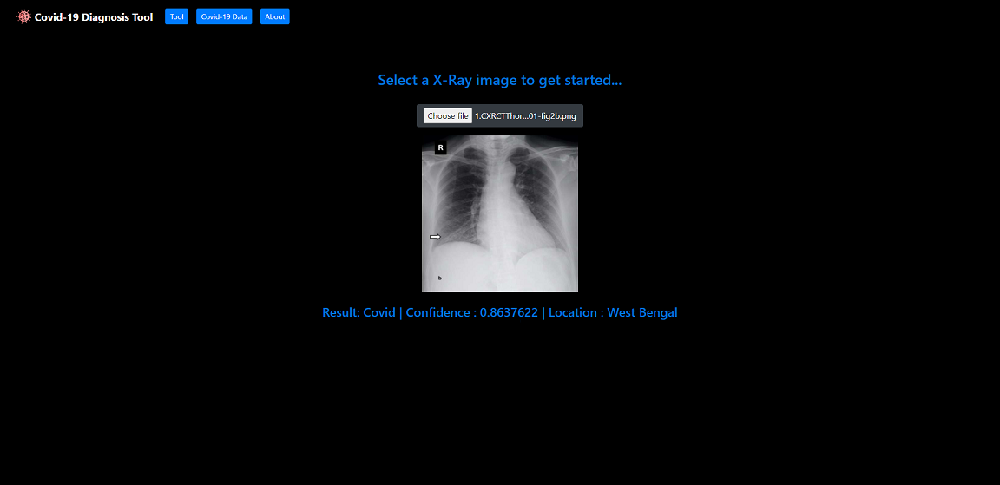

# Covid-19_Disease_Diagnosis

Covid-19 Diagnosis Python Flask Web App. It can detect COVID-19 from Chest image X-Ray <br>
<br><br>

## Required Tools

```
Python 3.6 or greater, Flask, Gevent, Scikit Learn, Scikit Image, Pytorch, Torchvision
```

## Pytorch version

```
pip install torch===1.7.1 torchvision===0.8.2 torchaudio===0.7.2 -f https://download.pytorch.org/whl/torch_stable.html
```

## Run

```
flask run
```
